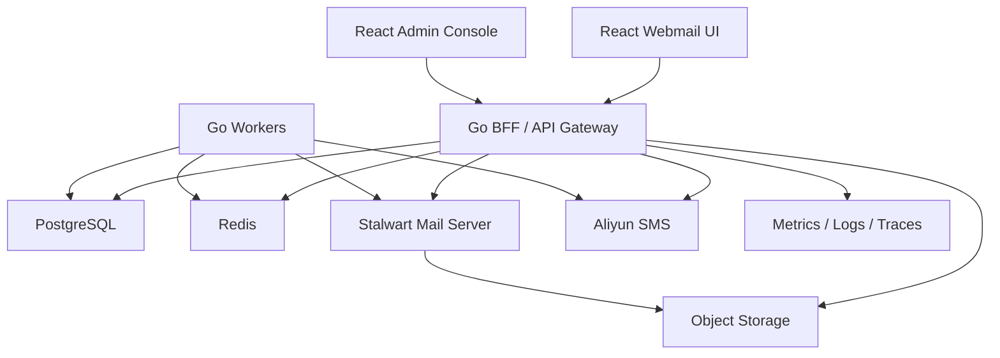

# InfiniteMail 系统架构

本文档是 InfiniteMail 商业化产品的工程边界。前端 UI 必须严格沿用当前样式：白底、细边框、`#009BF5` 主色、紧凑后台表单、圆角不超过现有风格，不引入新的视觉体系。

## 总体原则

- 前端只做体验和轻状态，不直连邮件服务器、不保存敏感密钥。
- Go BFF 是唯一业务入口，负责鉴权、注册策略、后台配置、注册码、短信验证码、邮箱账号映射和邮件 API 聚合。
- PostgreSQL 是核心业务数据库，保存账号、配置、邀请、短信、审计、会话和邮箱映射。
- Stalwart 是真实邮件底座，负责 SMTP、IMAP、JMAP、邮箱存储、投递和邮件协议兼容。
- Redis 用于验证码短 TTL、登录限流、幂等锁、短期缓存和异步任务协调。
- 后台配置驱动用户端表现，避免把域名、前缀、OAuth 文案、注册开关写死在前端。

## 本地端口约定

- 用户端 Web：`1788`
- 管理端 Web：`1888`
- Go BFF/API：`1666`

用户端和管理端必须分端口运行，不能再用同一个前端端口加 query 参数混在一起。开发期 Vite 的 `/api` 代理统一指向 `http://127.0.0.1:1666`。

## 分层架构



## 服务职责

### Frontend

- 保持当前 InfiniteMail 视觉风格。
- 用户端：邮箱登录、注册、邮箱工作台、写信、通讯录、设置。
- 管理端：域名、前缀策略、OAuth 展示名、注册策略、注册码、短信配置、验证码日志、账号列表、账号生命周期和任务中心。
- 前端只调用 BFF，不直接访问 Stalwart、PostgreSQL、阿里云或对象存储。

### Go BFF

建议服务名：`infinitemail-bff`。

职责：

- 统一鉴权：OAuth、手机号验证码、密码登录、session。
- 注册控制：注册码必填开关、开放注册开关、邮箱名前缀策略。
- 后台配置：域名、前缀、OAuth 文案、短信参数、登录注册入口和风控参数。
- 邮箱账号：创建、禁用、重置密码、绑定手机号、映射 Stalwart principal。
- 任务队列：注册、OAuth 首次开通和手动重试进入邮箱开通队列，后台任务按状态调用邮件服务开通接口并回写账号。
- 自动巡检：后台保存任务中心自动执行开关和间隔，BFF worker 周期触发邮箱开通队列。
- 邮件聚合：封装 Stalwart JMAP/管理接口或自建 SMTP/IMAP 协议，处理发信、附件、收件、草稿、详情、星标、移动、已读状态和投递追踪，返回前端稳定 DTO。
- 安全审计：管理员操作、验证码发送、登录失败、注册码使用。
- 稳定性：超时、重试、熔断、限流、幂等、事务和 outbox。

### PostgreSQL

核心表建议：

- `tenants`：平台/租户。
- `mail_domains`：域名、DNS 验证状态、DKIM 状态。
- `mail_accounts`：邮箱账号、本地部分、域名、状态、Stalwart principal id。
- `auth_identities`：手机号、密码哈希、OAuth subject、账号绑定。
- `admin_settings`：注册策略、OAuth 文案、前缀策略、短信配置。
- `mailbox_provision_jobs`：账号、邮箱、开通状态、尝试次数、错误、下次执行时间和完成时间。
- `invite_codes`：注册码、指定邮箱、绑定手机号、过期时间、使用状态。
- `sms_codes`：手机号、用途、验证码哈希、过期时间、发送状态。
- `sessions`：登录会话、刷新信息、撤销状态。
- `audit_logs`：管理员和关键用户操作审计。
- `outbox_events`：可靠异步事件，例如创建邮箱、发送短信、同步 Stalwart。

当前 BFF 已落地第一版 PostgreSQL 持久化：设置 `DATABASE_URL` 后会自动执行 `bff/migrations`，并把配置、账号、注册码、短信日志、审计日志、会话、邮箱设置和基础邮件写入规范化表；`bff_state_snapshots` 仅作为过渡兜底。

邮箱开通任务已落到 `mailbox_provision_jobs`；任务中心可统一执行邮箱开通队列，并通过 `admin_mail_config.ops` 保存自动执行开关、间隔和最近执行结果。邮件服务配置保存在 `admin_mail_config.mailbox.server`，管理令牌、SMTP 密码和 IMAP 密码只在后端持久化，返回管理端时脱敏；开通接口负责创建邮箱账号，生命周期接口负责禁用、启用和重置密码同步，HTTP 数据面或 SMTP/IMAP 协议负责把用户端读写动作同步到真实邮件底座。

### 邮件服务 Provisioning 协议

BFF 向 `mailbox.server.provisionPath` 发起 `POST`，相对路径会拼接 `mailbox.server.baseUrl`，完整 URL 会直接使用。请求头包含 `Idempotency-Key`、`Authorization: Bearer <adminToken>` 和 `X-Admin-Token`。请求体包含账号 ID、邮箱地址、本地部分、域名、展示名、手机号、来源和随机邮箱密码。邮件服务返回 `externalId`、`principalId` 或 `id` 时，BFF 会写入 `mailboxExternalId`。返回 `409` 表示账号已存在，按幂等成功处理。

BFF 向 `mailbox.server.lifecyclePath` 发起 `POST` 同步账号生命周期。请求体包含 `action`、账号 ID、邮箱地址、外部账号 ID、展示名、手机号；重置密码时额外包含临时密码。远端返回非 `2xx` 时，BFF 不会提前修改本地账号状态，避免“本地禁用但真实邮箱仍可用”的商业风险。

### 邮件数据面协议

BFF 已实现用户端契约：`GET /messages`、`GET /messages/{messageID}`、`POST /messages/send`、`POST /drafts`、`PATCH /messages/{messageID}/star`、`POST /messages/{messageID}/move`、`PATCH /messages/{messageID}/read`。已发送、附件、草稿、读状态和投递追踪字段会落入 `mail_messages`/JSON store；生产严格模式会阻止缺失的真实数据面接口返回兼容结果。

真实邮件服务接入时，后台配置 `messageListPath`、`messageDetailPath`、`messageSendPath`、`draftPath`、`messageStarPath`、`messageMovePath` 和 `messageReadPath`。BFF 会向收件列表和详情接口发送账号上下文并缓存远端邮件；向发信、草稿、星标、移动和已读接口发送账号 ID、邮箱地址、本地部分、域名、展示名、手机号、收件人、正文、附件元数据、附件 base64 兜底内容、读状态和 `metadata`，并携带 `Idempotency-Key`、`Authorization: Bearer <adminToken>`、`X-Admin-Token`。发信返回的 `providerMessageId`、`acceptedAt` 和投递错误字段会持久化，便于后续接收投递回调或做客服追踪。如果已有自建邮件服务器且开放 25/587/465，后台也可以启用 SMTP 直连发信；BFF 会生成标准 MIME 邮件并把 To/Cc/Bcc 作为 SMTP 信封收件人投递。如果邮件服务器开放 143/993，后台可启用 IMAP 直连收件；BFF 会用账号模板登录 IMAP，拉取收件列表和详情，同步 `\Flagged`、`\Seen`、MOVE/COPY 和 Drafts APPEND。SMTP+IMAP 配齐后，可以替代对应 HTTP 发信、收件、草稿和读写状态接口。

### Stalwart

职责：

- SMTP 入站和出站。
- JMAP/IMAP/POP3 邮件访问。
- 邮箱数据存储、搜索、配额和邮件协议兼容。
- 域名、账号、队列和邮件服务配置。

BFF 不复制完整邮件正文到 PostgreSQL；PostgreSQL 只保存业务映射、策略和审计。邮件正文和附件属于 Stalwart/对象存储的数据面。

本仓库的 `docker-compose.yml` 已提供 `mailserver` profile，可用 `docker compose --profile mailserver up --build` 同时启动 Stalwart。该服务使用官方镜像 `stalwartlabs/stalwart:v0.16`，开放 25/465/587、143/993 和 8080，并用独立卷持久化 `/etc/stalwart` 与 `/var/lib/stalwart`。上线时先完成 Stalwart WebUI 初始化，再把服务地址、管理员令牌、SMTP/IMAP 参数保存进管理后台；生产环境不要长期保留默认 recovery admin。

### Redis

- 验证码短 TTL。
- 手机号/IP 发送频率限制。
- 登录失败计数。
- 注册码使用短锁。
- JMAP message list 短缓存。
- 后台配置版本缓存。

## API 边界

### Admin

```text
GET    /api/admin/mail/config
PATCH  /api/admin/mail/config
POST   /api/admin/mail/domains/verify
POST   /api/admin/mail/server/test
POST   /api/admin/mail/invites
GET    /api/admin/mail/invites
GET    /api/admin/mail/accounts
GET    /api/admin/mail/sms-logs
GET    /api/admin/mail/audit-logs
POST   /api/admin/mail/domains/:id/verify
POST   /api/admin/mail/accounts/:id/disable
POST   /api/admin/mail/accounts/:id/enable
POST   /api/admin/mail/accounts/:id/reset-password
POST   /api/admin/mail/accounts/:id/provision
POST   /api/admin/mail/ops/run
```

### Auth

```text
POST   /api/auth/oauth/start
GET    /api/auth/oauth/callback
POST   /api/auth/sms/send
POST   /api/auth/register
POST   /api/auth/login
POST   /api/auth/logout
GET    /api/auth/session
```

### Mail

```text
GET    /api/mail/bootstrap
GET    /api/mail/messages
GET    /api/mail/messages/:id
POST   /api/mail/messages/send
POST   /api/mail/drafts
PATCH  /api/mail/messages/:id/star
POST   /api/mail/messages/:id/move
PATCH  /api/mail/settings
```

## 性能与稳定性

- Go BFF 保持无状态，水平扩容。
- PostgreSQL 使用连接池、读写事务边界、必要索引和慢查询监控。
- 所有外部调用必须有 timeout，邮件服务器和短信服务必须有 retry budget。
- 创建邮箱、发送短信、发送邀请等动作使用幂等 key。
- 邮箱开通接口必须支持幂等，至少识别 `Idempotency-Key` 或 `provisionJobId`。
- 关键写操作使用数据库事务 + outbox，避免“数据库成功但邮件服务器失败”的不一致。
- 验证码、登录、注册、注册链接都做限流和审计。
- 注册码创建、开放注册、邮箱开通都必须记录审计日志并走服务端校验。
- 管理配置使用版本号，前端 bootstrap 返回配置版本，便于缓存刷新。
- 邮件列表可短缓存；邮件正文按需加载，避免大体积同步。
- 生产部署必须包含备份、PITR、监控告警和健康检查。

## 生产部署建议

```text
Nginx/Caddy
  -> infinitemail-web static
  -> infinitemail-bff Go service
  -> Stalwart HTTP/JMAP

PostgreSQL primary + backup/PITR
Redis
Stalwart Mail Server
Go worker
Object storage
Aliyun SMS
Prometheus/Grafana/Loki or equivalent
```

## 开发顺序

1. 保持现有 UI，所有默认脚本走 Go BFF。
2. 配置 PostgreSQL，把业务数据写入规范化表。
3. 部署 Stalwart 或现有自建邮件服务器，完成域名 DNS、MX、SPF、DKIM、DMARC。
4. BFF 对接邮件底座，注册成功时创建真实邮箱账号。
5. 邮件列表、详情、发信、附件、草稿、星标、移动和已读状态全部由 BFF 聚合真实数据面。
6. 加入审计、限流、告警、备份和压测。
